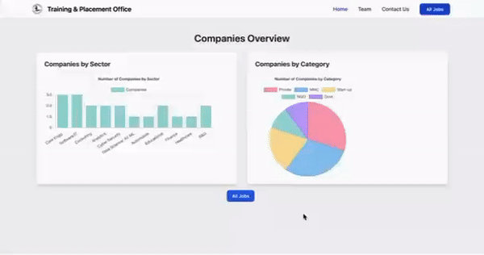
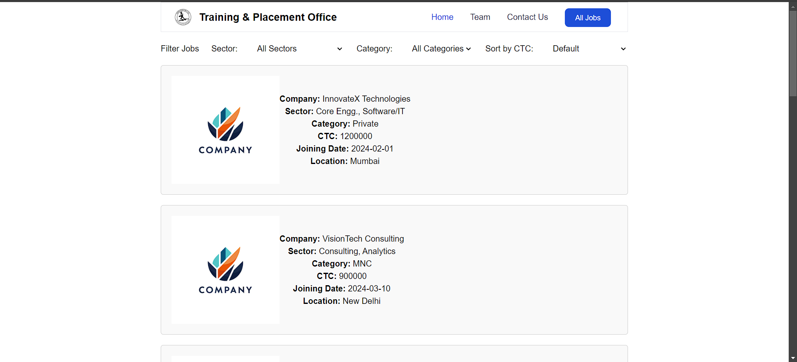
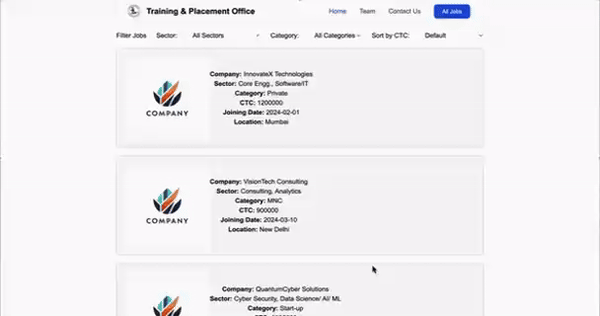
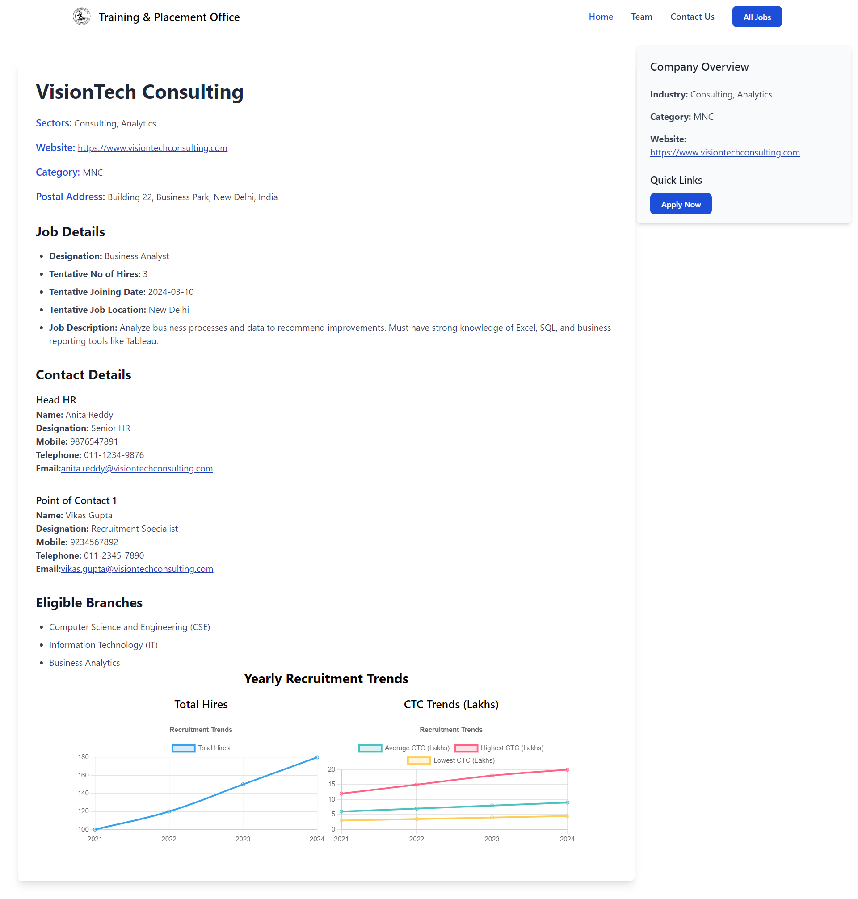

# Job Recruitment Dashboard

This project is a job recruitment dashboard built using **React** and **Tailwind CSS**. It allows users to view job listings, explore sectors and categories, and view job details.

## Features

- **Job Listings**: View a list of all available jobs.
- **Sector Jobs**: Filter and explore jobs based on different sectors.
- **Category Jobs**: View job listings by categories.
- **Job Details**: Click on a job to see detailed information about the role and the company.
- **Recruitment Data Analysis**: Year-wise recruitment trends and CTC analysis displayed graphically.

## Technologies Used

- **React**: Frontend library
- **Tailwind CSS**: For responsive design and styling
- **React Router**: For navigation between different pages
- **JavaScript**: Logic and interactivity
- **JSON Data**: Job data is stored in a JSON file for simplicity

## Installation

1. Clone the repository:
    ```bash
    git clone https://github.com/yourusername/job-recruitment-dashboard.git
    ```
2. Navigate to the project directory:
    ```bash
    cd job-recruitment-dashboard
    ```
3. Install the required dependencies:
    ```bash
    npm install
    ```
4. Start the development server:
    ```bash
    npm run dev
    ```

## Screenshots

### Home Page



On the Home Page, clicking on a graph automatically applies the corresponding filter for job sectors or categories.

### Job Listings



On the Job Listings page, users can explore a wide range of available job postings with details like job title, company, location, and more.


### Filtered Job 



On the Filtered Job Listings page, users can view job postings based on the applied filters such as sectors, categories, or other criteria.

### Job Detail Page



The Job Detail Page provides comprehensive information about a specific job, including the job designation, company details, job description, location, and joining date.


